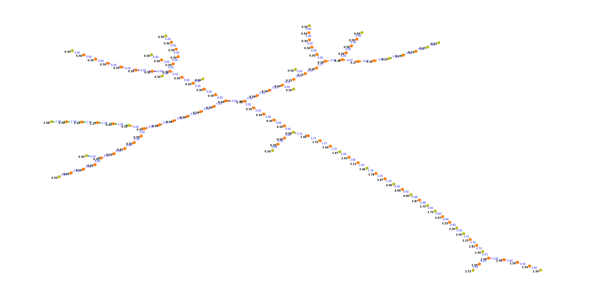

# Experiments with model railroad network graphs

The layout below is stored in a file created by the xtrkcad program.

That file is read by custom Python code and graph object is generated with the Python library networkx.  
Networkx provides tools to convert the graph into a spanning tree.  The spanning tree has all the nodes and edges but because it is a tree it can be "walked" in an orderly way.  This allows a the program to walk through the tree and fill in the missing heights, so that every node has a height.

The spanning tree looks like this (currenly showing grades on the edges):

The logical layout uses the Graphviz "neato" layout.  The physical layout uses the original (x,y) coordinates from xtrkcad, but with straight edges.

