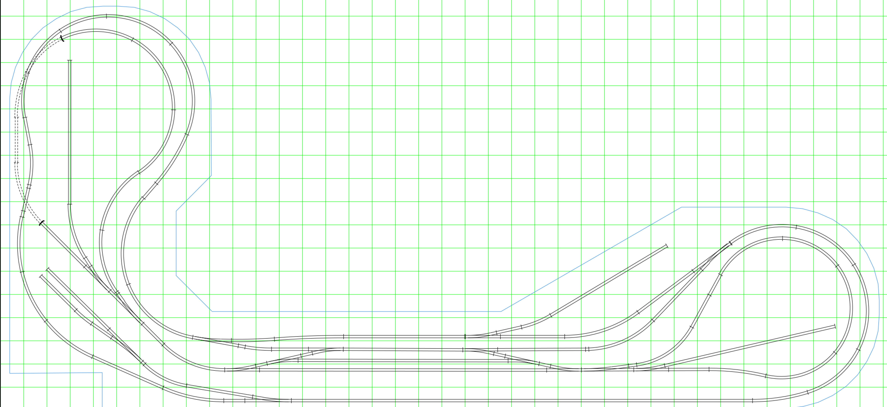
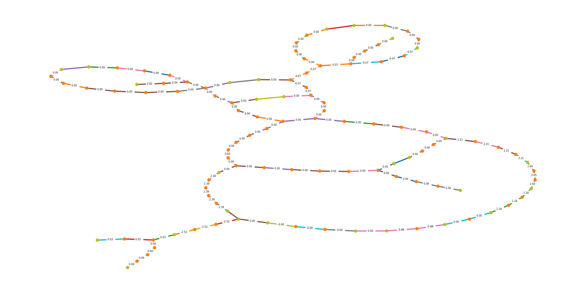
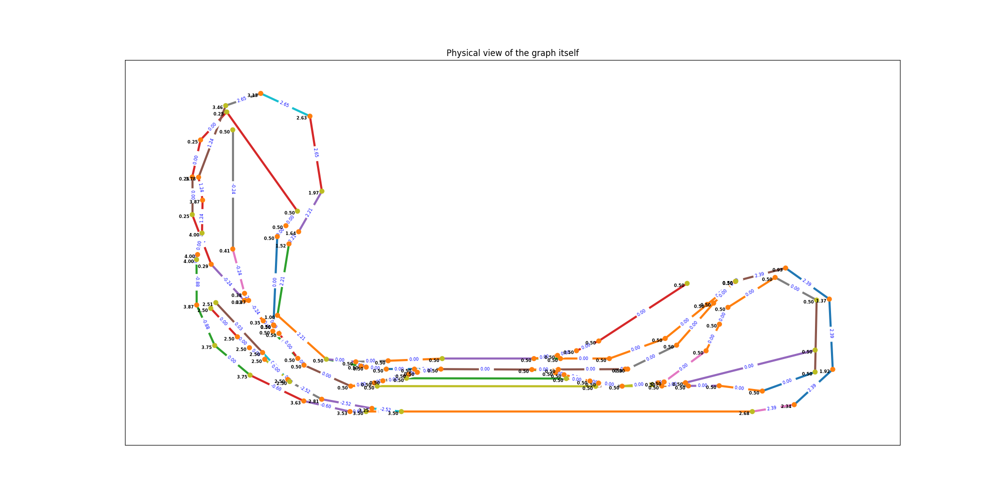

# Experiments with model railroad network graphs

The layout below is stored in a file created by the xtrkcad program.

That file is read by custom Python code and graph object is generated with the Python library networkx.  
Networkx provides tools to analyze the graph.  Here it shows cycles that it found and "bridges" in red where there was not cycle.

The logical layout uses the Graphviz "neato" layout.  The physical layout uses the original (x,y) coordinates from xtrkcad, but with straight edges.

