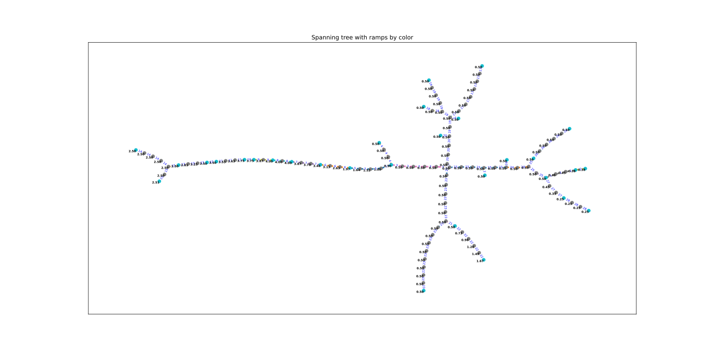
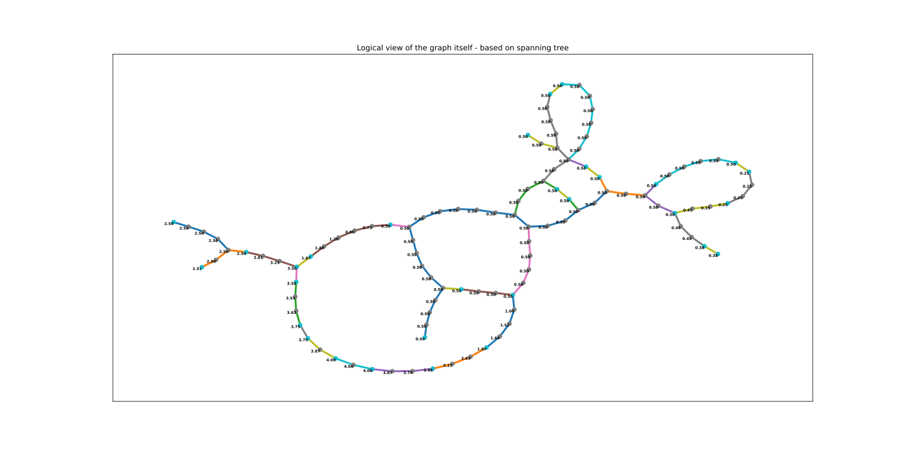

# Experiments with model railroad network graphs

The layout below is stored in a file created by the xtrkcad program.

That file is read by custom Python code and graph object is generated with the Python library networkx.  

# General layout info

The logical layout uses the Graphviz "neato" layout.  The physical layout uses the original (x,y) coordinates from xtrkcad, but with straight edges.

## Depth First Search
This method seems to resolve the problem with the un-walked edges that occurs with the  method.

## Spanning Tree
Networkx provides tools to convert the graph into a spanning tree.  The spanning tree has all the nodes (but not all the edges). Because it is a tree it can be "walked" in an orderly way.  This allows a the program to walk through the tree and fill in the missing heights, so that every node has a height.

There is a problem with this method.  Not all edges are accounted for in the spanning tree (although all nodes are).  The missing edges are because adjacent nodes end up on different branches of the tree. These end up not labeled and if they should be on a grade this is not taken into account.

The spanning tree looks like this (currenly showing grades on the edges):

